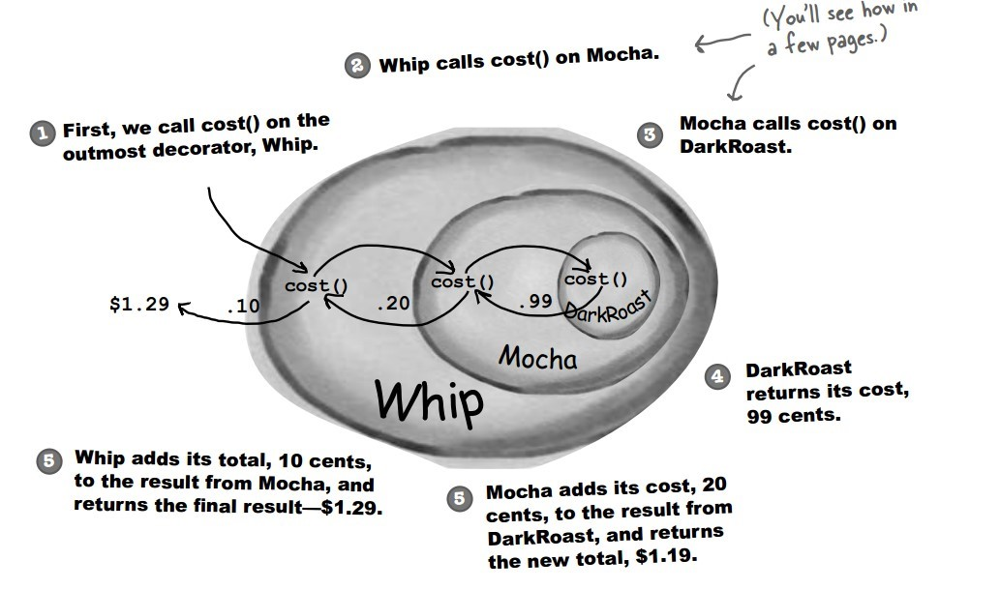

实现 设计不同种类的饮料，饮料可以添加配料，比如可以添加牛奶，并且支持动态添加新配料
。每增加一种配料，该饮料的价格就会增加，要求计算一种饮料的价格。 下图表示在
DarkRoast 饮料上新增新添加 Mocha 配料，之后又添加了 Whip 配料。DarkRoast 被 Mocha
包裹，Mocha 又被 Whip 包裹。它们都继承自相同父类，都有 cost() 方法，外层类的 cost()
方法调用了内层类的 cost() 方法。

设计原则 类应该对扩展开放，对修改关闭: 也就是添加新功能时不需要修改代码。
饮料可以动态添加新的配料，而不需要去修改饮料的代码。 
不可能把所有的类设计成都满足这一原则，应当把该原则应用于最有可能发生改变的地方。